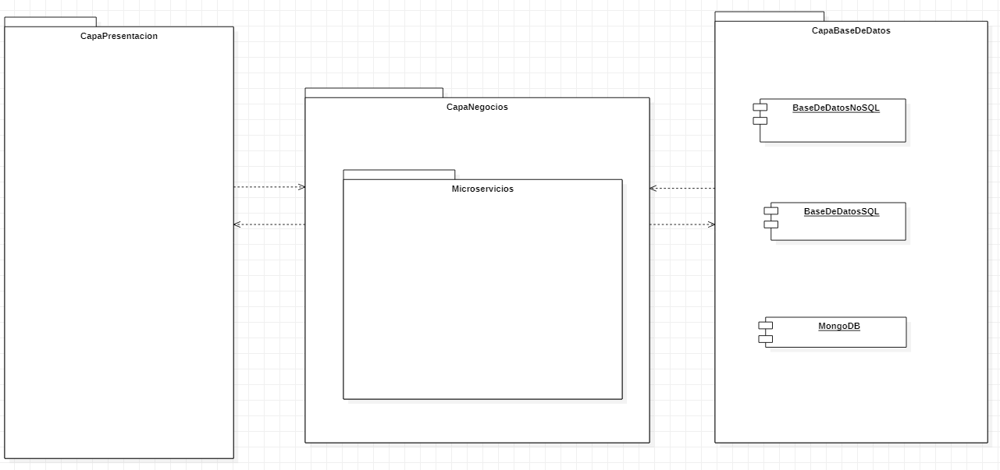
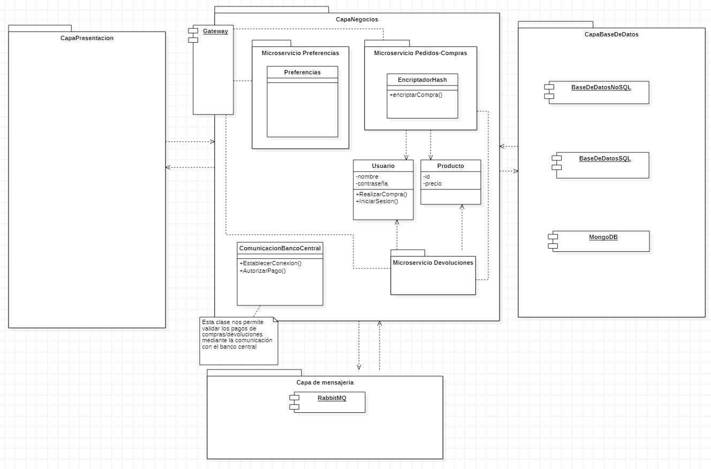

<h1>DAS_JUNIO</h1>
<h2>ÍNDICE</h2>
<ol>
  <li><a href ="#requisitos">REQUISITOS</a></li>
  <li><a href ="#tiempos">TABLA TIEMPOS</a></li>
  <li><a href ="#iter-1">ITERACIÓN 1</a>
    <ol>
      <li><a href = "#iter-1-decitions">DECISIONES</a></li>
      <li><a href = "#iter-1-uml">UML</a></li>
    </ol>
  </li>
  <li><a href ="#iter-2">ITERACIÓN 2</a>
    <ol>
      <li><a href = "#iter-2-decitions">DECISIONES</a></li>
      <li><a href = "#iter-2-uml">UML</a></li>
    </ol>
  </li>
  <li><a href ="#iter-3">ITERACIÓN 3</a>
    <ol>
      <li><a href = "#iter-3-decitions">DECISIONES</a></li>
      <li><a href = "#iter-3-uml">UML</a></li>
    </ol>
  </li>
  <li><a href ="#iter-final">ITERACIÓN FINAL</a>
    <ol>
      <li><a href = "#iter-final-decitions">DECISIONES</a></li>
      <li><a href = "#iter-final-uml">UML</a></li>
    </ol>
  </li>
</ol>
 
<h2 id="requisitos">REQUISITOS</h2>
<table style="width: 100%; text-align: center;">
  <tr>
    <td style="width: 25%; text-align: justify;">Nº DEL REQUISITO</td>
    <td style="width: 25%; text-align: justify;">NOMBRE</td>
    <td style="width: 25%; text-align: justify;">DESCRIPCIÓN</td>
    <td style="width: 25%; text-align: justify;">DECISION</td>
  </tr>
  <tr>
    <td style="width: 25%; text-align: justify;">1</td>
    <td style="width: 25%; text-align: justify;">Migración de la arquitectura</td>
    <td style="width: 25%; text-align: justify;">Se desea migrar la antigua capa de negocio a una basada en microservicios más escalables y flexibles, éstos se deben poder integrar en la aplicación de forma asíncrona y se debe de almacenar la dirección del microservicio en una BBDD MongoDB para poder acceder a ellos en todo momento. El sistema contendrá los siguientes microservicios:</td>
    <td style="width: 25%; text-align: justify;"><a href="./Decision%201.md">Decision 1</a></td>
  </tr>
  <tr>
    <td style="width: 25%;">RF1.2</td>
    <td style="width: 25%;">Microservicio preferencias</td>
    <td style="width: 25%;">Es necesario que un microservicio almacene las preferencias de los usuarios, almacenando los artículos que compra, el nombre del usuario, y el precio que ha pagado por el artículo en cuestión, éstos datos se almacenarán en una base de datos NoSQL ya existente.</td>
    <td style="width: 25%;"><a href="./Decision%202.md">Decision 2</a></td>
  </tr>
  <tr>
    <td style="width: 25%;">RF1.3</td>
    <td style="width: 25%;">Microservicio pedidos y compras</td>
    <td style="width: 25%;">Es necesario un microservicio dedicado a que el usuario haga pedidos y compras, éstos se gestionan gracias al id del producto y del cliente que compra, éstas se deben de almacenar en una BBDD SQL a través de un bus de eventos lógicos, y se debe impedir al usuario intentar comprar más de 5 veces.</td>
    <td style="width: 25%;"><a href="./Decision%202.md">Decision 2</a></td>
  </tr>
  <tr>
    <td style="width: 25%;">RF1.4</td>
    <td style="width: 25%;">Comunicación de microservicios</td>
    <td style="width: 25%;">Los microservicios han de comunicarse entre ellos usando el protocolo REST, así como comunicarse con los elementos fuera del sistema a través de un gateway que debe soportar comunicaciones HTTP</td>
    <td style="width: 25%;"><a href="./Decision%202.md">Decision 2</a></td>
  </tr>
  <tr>
    <td style="width: 25%;">RF1.5</td>
    <td style="width: 25%;">Microservicio de devoluciones</td>
    <td style="width: 25%;">Se desea que el usuario pueda realizar una devolución de una compra a través de un microservicio, éste se debe de comunicar con el microservicio de compras para verificar que la devolución pertenece a las compras realizadas.</td>
    <td style="width: 25%;"><a href="./Decision%202.md">Decision 2</a></td>
  </tr>
  <tr>
    <td style="width: 25%;">RF2</td>
    <td style="width: 25%;">Módulos de negocio</td>
    <td style="width: 25%;">La aplicación que migramos se divide en distintos módulos que se han de mantener, los cuales son:</td>
    <td style="width: 25%:"><a href="./Decision%201.md">Decision 1</a></td>
  </tr>
  <tr>
    <td style="width: 25%;">RF2.2</td>
    <td style="width: 25%;">Módulo de pagos</td>
    <td style="width: 25%;">El sistema debe de gestionar los pagos realizados por nuestros clientes desde el microservicio de compras, que lo valide para que ésta se realice con éxito.</td>
    <td style="width: 25%;"><a href="./Decision%203_1.md">Decision 3.1</a></td>
  </tr>
  <tr>
    <td style="width: 25%;">RF2.3</td>
    <td style="width: 25%;">Módulo de mensajería</td>
    <td style="width: 25%;">El sistema debe tener un módulo de mensajería como una capa horizontal debajo de la capa de negocio, soportado por un middleware externo a nuestro sistema, que usará el protocolo de AMQP.</td>
    <td style="width: 25%;"><a href="./Decision%203_2.md">Decision 3.2</a></td>
  </tr>
  <tr>
    <td style="width: 25%;">RF2.4</td>
    <td style="width: 25%;">Módulo de seguridad</td>
    <td style="width: 25%;">Es necesario que exista un módulo de seguridad en compras.</td>
    <td style="width: 25%;"><a href="./Decision%203_3.md">Decision 3.3</a></td>
  </tr>
  <tr>
    <td style="width: 25%;">RF3</td>
    <td style="width: 25%;">Coherencia entre las bases de datos.</td>
    <td style="width: 25%;">La coherencia entre las distintas bases de datos se gestionará mediante un bus de eventos lógicos. El cliente sugiere que utilicen tecnología de mensajería como RabbitMQ o un “bus” dedicado como Azure Service Bus.</td>
    <td style="width: 25%;"><a href="./Decision%204.md">Decision 4</a></td>
  </tr>
</table>
 
<h2 id ="tiempos">TABLA DE TIEMPOS</h2>
<table style="width: 100%; text-align: center;">
  <tr>
    <td style="width: 17%;">Semana</td>
    <td style="width: 17%;">Iteración</td>
    <td style="width: 17%;">Tiempo en ADD</td>
    <td style="width: 17%;">Tiempo de reflexión</td>
    <td style="width: 17%;">Tiempo de refinado</td>
    <td style="width: 17%;">Tiempo de diseño</td>
  </tr>
  <tr>
    <td style="width: 17%;">1</td>
    <td style="width: 17%;">1</td>
    <td style="width: 17%;">30</td>
    <td style="width: 17%;">15</td>
    <td style="width: 17%;">0</td>
    <td style="width: 17%;">0</td>
  </tr>
  <tr>
    <td style="width: 17%;">1</td>
    <td style="width: 17%;">2</td>
    <td style="width: 17%;">30</td>
    <td style="width: 17%;">20</td>
    <td style="width: 17%;">5</td>
    <td style="width: 17%;">180</td>
  </tr>
  <tr>
    <td style="width: 17%;">2</td>
    <td style="width: 17%;">3</td>
    <td style="width: 17%;">40</td>
    <td style="width: 17%;">20</td>
    <td style="width: 17%;">20</td>
    <td style="width: 17%;">130</td>
  </tr>
  <tr>
    <td style="width: 17%;">3</td>
    <td style="width: 17%;">4</td>
    <td style="width: 17%;">120</td>
    <td style="width: 17%;">25</td>
    <td style="width: 17%;">35</td>
    <td style="width: 17%;">150</td>
  </tr>
  <tr>
    <td style="width: 17%;">3</td>
    <td style="width: 17%;">5</td>
    <td style="width: 17%;">200</td>
    <td style="width: 17%;">35</td>
    <td style="width: 17%;">15</td>
    <td style="width: 17%;">810</td>
  </tr>
</table>
 
<h2 id = "iter-1">ITERACIÓN 1</h2>
<h3 id ="iter-1-decitions">DECISIONES</h3>
<ul>
  <li><a href = "./Decision%201.md">Decisión 1</a></li>
</ul>
 
<h3 id ="iter-1-uml">UML</h3>

 
<h2 id = "iter-2">ITERACIÓN 2</h2>
<h3 id ="iter-2-decitions">DECISIONES</h3>
<ul>
  <li><a href = "./Decision%202.md">Decisión 2</a></li>
  <li><a href = "./Decision%203_1.md">Decisión 3.1</a></li>
  <li><a href = "./Decision%203_2.md">Decisión 3.2</a></li>
  <li><a href = "./Decision%203_3.md">Decisión 3.3</a></li>
</ul>
 
<h3 id="iter-2-uml">UML</h3>

 
<h2 id = "iter-3">ITERACIÓN 3</h2>
<h3 id ="iter-3-decitions">DECISIONES</h3>
<ul>
  <li><a href="./Decision%204.md">Decision 4</a></li>
</ul>
 
<h3 id ="iter-3-uml">UML</h3>

 
<h2 id = "iter-final">ITERACIÓN FINAL</h2>
<h3 id ="iter-final-decitions">DECISIONES</h3>
<ul>
  <li><a href = "./MADR_FORMAT.md">Ejemplo decision</a></li>
</ul>
 
<h3 id ="iter-final-uml">UML</h3>

 
